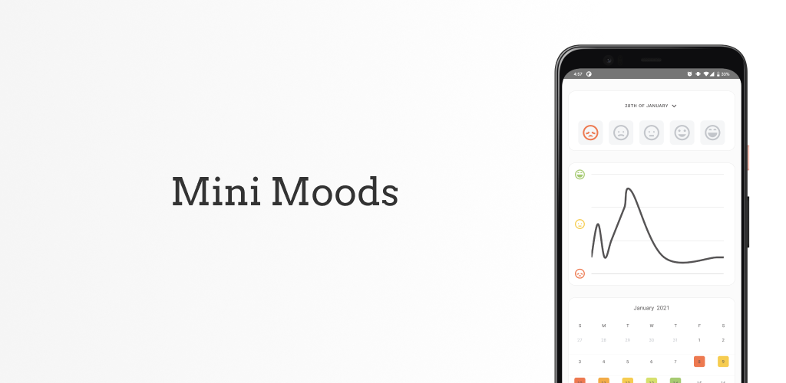
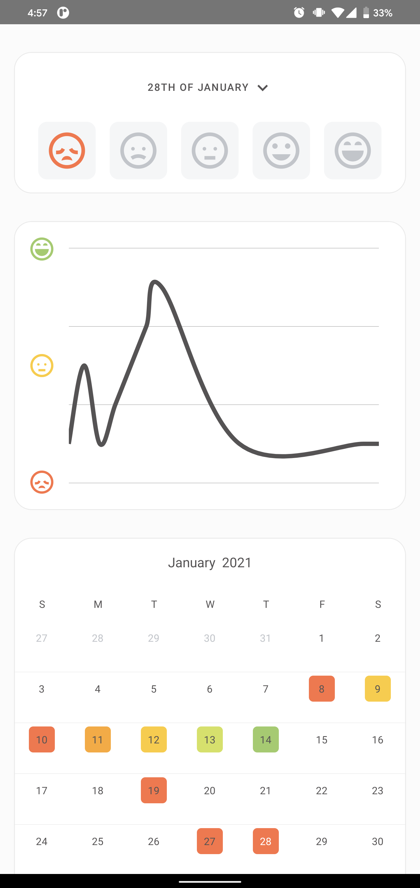
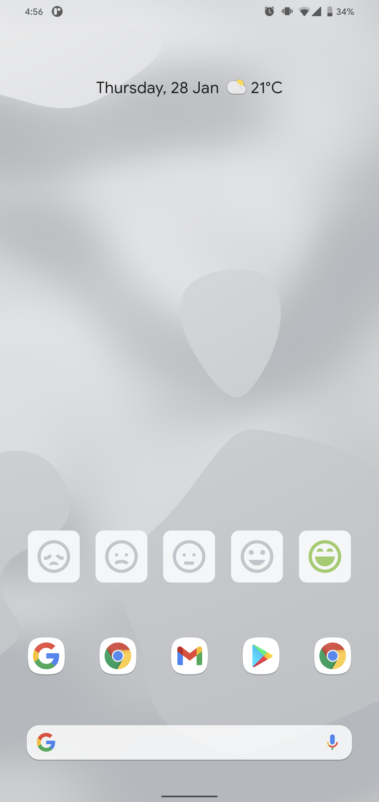
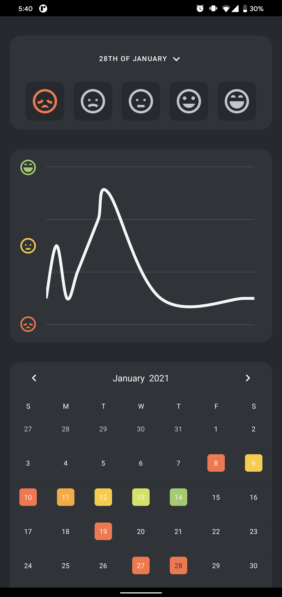
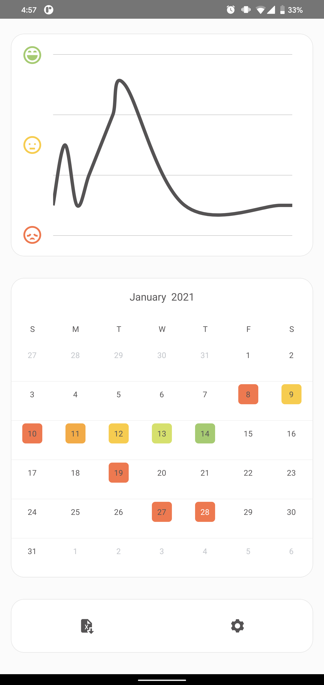
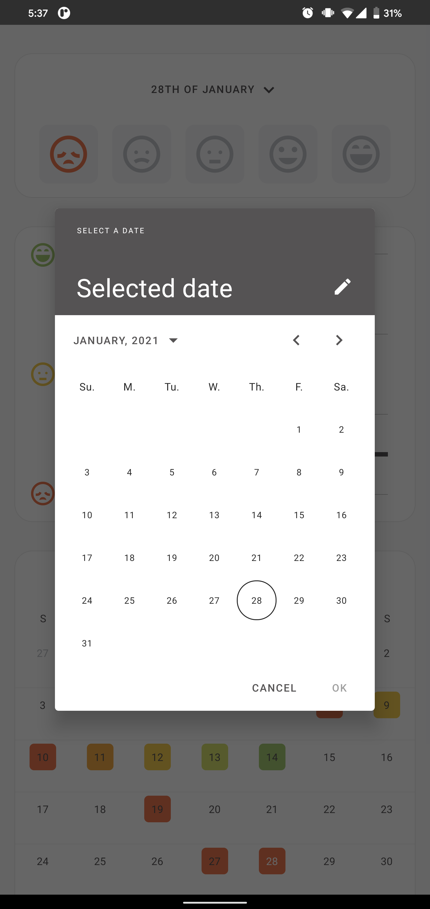

# Mini Moods

Mini Moods is an ad-free, open-source, no-frills mood tracker that gives you full control over your data.

|     |     |     |     |     |
|:---:|:---:|:---:|:---:|:---:|
| | | | ||

# Features

- **Minimal interface**. Mini Moods provides a simple, clear and elegant user interface that makes entering and tracking
  your data super simple.

- **No Frills**. Other apps often include accounts, mandatory internet connections, ads, event logging or daily
  descriptions whereas Mini Moods was created to simplify the process of mood tracking.

- **Monthly Tracking**. All your historical moods are visible on a monthly basis within the app. You can select a single
  month at a time to view daily moods and trends.

- **Data Export**. To view more than one month at a time, Mini Moods allows you to export your data in CSV format.

- **Widget**. The Mini Mood widget allows you to view, modify or add today's mood from your desktop without the need to
  open an app.

- **Dark Mode**. Native support for dark-mode built into all aspects of the app including widgets.

- **Open Source & Completely Ad-Free**. In addition to giving you access to all your data through the CSV export, Mini
  Moods is open source and contains no ads. You can view the source and contribute
  here: https://github.com/CampbellMG/MiniMoods

# Contributing

Feel free to [open an issue](https://github.com/CampbellMG/MiniMoods/issues/new) with any issues or suggestions for the
app. If you'd like to contribute a change, feel free to open a pull request. 
